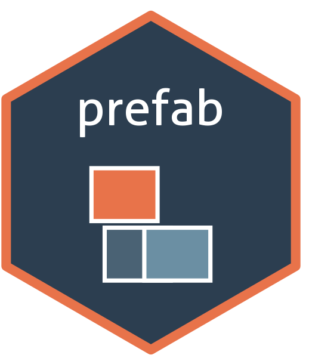

# prefab <a href="https://economic.github.io/prefab"></a>

prefab provides an opinionated theme system for setting up R projects. A
theme is a function that returns an ordered list of steps that deploy
files, inject text, or run functions. Because themes are functions, they
take parameters, compose with `+`, and ship in packages. Nothing touches
the file system until you apply a theme with `use_theme()` or
`create_project()`.

## Installation

``` r
install.packages(
  "prefab",
  repos = c("https://economic.r-universe.dev", getOption("repos"))
)
```

## Quick start

Create a new project with scaffolding and Claude Code config:

``` r
library(prefab)

create_project("~/projects/my-analysis", r_analysis() + claude_r_analysis())
#> ✔ Running fs::dir_create('data_raw')
#> ✔ Running fs::dir_create('data_processed')
#> ✔ Writing 'main.R' (new)
#> ✔ Writing 'README.md' (new)
#> ✔ Writing '.gitignore' (new)
#> ✔ Writing '.claude/settings.json' (new)
#> ✔ Writing '.claude/rules/r_analysis.md' (new)
#> ✔ Writing '.gitignore' (union)
```

Add a theme to an existing project:

``` r
use_theme(claude_r_analysis())
#> ✔ Writing '.claude/settings.json' (new)
#> ✔ Writing '.claude/rules/r_analysis.md' (new)
#> ✔ Writing '.gitignore' (new)
```

## Built-in themes

| Theme | Description |
|----|----|
| `r_analysis()` | `main.R`, `README.md`, `.gitignore`, `data_raw/`, `data_processed/` |
| `r_targets()` | `_targets.R`, `packages.R`, `README.md`, `R/` dir, `.gitignore` |
| `claude_r_analysis()` | Claude Code settings and rules for data analysis projects |
| `claude_r_package()` | Claude Code settings and rules for R packages |
| `claude_r_targets()` | Claude Code settings and rules for targets projects |

## Composition

Themes compose with `+`. Steps execute left-to-right:

``` r
theme <- r_targets() + claude_r_targets()

create_project("my-project", theme)
#> ✔ Writing '_targets.R' (new)
#> ✔ Writing 'packages.R' (new)
#> ✔ Writing 'README.md' (new)
#> ✔ Writing '.gitignore' (new)
#> ✔ Running fs::dir_create('R')
#> ✔ Writing '.claude/settings.json' (new)
#> ✔ Writing '.claude/rules/r_targets.md' (new)
#> ✔ Writing '.claude/rules/r_analysis.md' (new)
#> ✔ Writing '.gitignore' (union)
```

## Building custom themes

**From a directory of files.** Arrange template files in a folder and
`theme_from_dir()` turns them into a theme. An optional `_prefab.yml`
sidecar controls per-file merge strategies and template data.

``` r
my_theme <- theme_from_dir("~/my-extras")
```

**From steps.** Build themes programmatically with `step_file()`,
`step_text()`, and `step_run()`:

``` r
my_theme <- function() {
  new_theme(
    step_file("~/my_themes/header.R", "R/header.R"),
    step_text(c("*.csv", "*.rds"), ".gitignore", strategy = "union"),
    step_run(fs::dir_create, "tables", .label = "fs::dir_create('tables')")
  )
}
```

**By composing existing themes.** Combine and extend built-in or custom
themes with `+`:

``` r
my_theme <- r_analysis() + claude_r_analysis() + theme_from_dir("~/my-extras")
```

## Sharing and re-using custom themes

**Source a file.** Save theme functions in an external script and source
them. `load_themes()` makes that easy: put themes in
`~/.prefab-themes.R` (or set the `PREFAB_THEMES` environment variable)
and call `load_themes()` to make them available.

``` r
load_themes()
use_theme(my_analysis_theme())
```

**Ship in a package.** This package ships with several basic themes, and
you can add themes (which are just functions) to your own package. Use
`from_package()` to resolve template files from `inst/`. Best for
sharing themes across an organization.

More information on building and deploying themes is in the [Getting
Started
vignette](https://economic.github.io/prefab/articles/prefab.html).

## Acknowledgments

This package draws heavily on ideas from the R packages:

- [starter](https://www.danieldsjoberg.com/starter/) by Daniel D.
  Sjoberg
- [tflow](https://milesmcbain.r-universe.dev/tflow) by Miles McBain
- [usethis](https://usethis.r-lib.org/) by Hadley Wickham, Jennifer
  Bryan, Malcolm Barrett, and Andy Teucher.
